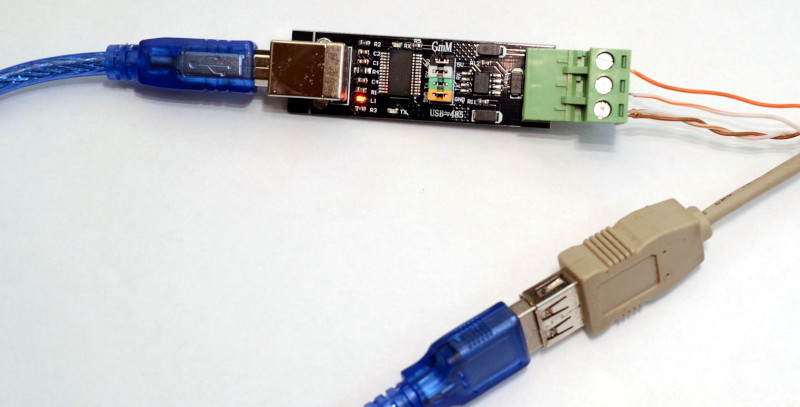
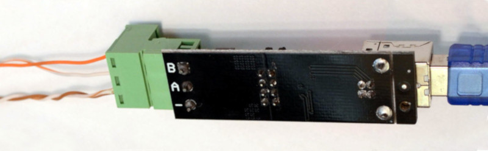

# Valden Heat Pump integration example

This example shows how to access the Valden Heat Pump data from your server, Raspberry Pi, and so on.<br><br>

All you need is a USB->RS485 converter and python2 installed.<br>
Connect your computer to RS485 line as pictured below, connect another side of wire like described at [Valden Display page](https://github.com/openhp/Display/) and run python script from an example below.<br>
Remember, RS485 is a 3-wire line. Do not use cheap converters without "signal ground" and with only A and B. They'll work for a few meters distances.<br>

<br>
<br><br>


```python
import serial
from time import sleep
import datetime
import string
import sys

#-------------------------------------------------------
#function to send commands and print answers
def SendCommand(ID_to, command):
	#send command
	towrite = str(ID) +  str(ID_to) + command
	print "> " + str(datetime.datetime.now())[0:19] + " we sent: " + towrite
	try:
		serial.write(towrite)
	except:		#do not catch all exceptions in a real code
		print "USB>Serial converter disconnected?", sys.exc_info()
		line = None
		return 0
		
	#read result
	try:
		line = serial.readline()   # read a '\n' terminated line
	except:		#do not catch all exceptions in a real code
		print "USB>Serial converter disconnected?", sys.exc_info()
		line = None
		return 0

	#print answer
	if len(line) > 2:
		print "< " + str(datetime.datetime.now())[0:19] + " we got: "+ line
	else:
		print "No answer from", ID_to, "\t\t", str(datetime.datetime.now())[0:19]

#-------------------------------------------------------
#open serial
print "Starting.."
try:
	serial = serial.Serial('/dev/ttyUSB2', 9600, timeout=3)		#Change serial name to yours!
	print "Opened: ", serial.name
except serial.serialutil.SerialException:
	print "Serial open error! Change serial name to yours! (ex: /dev/ttyUSB5, or something like COM9 at win)"
	exit (0)

#-------------------------------------------------------
#some example values
eev_target = "02.50"		#new eev temperature difference
newtemp = "31.50"		#new setpoint temperature

ID 	= chr(0x30)		#this script ID, 0x30 by default, default value supported by all Valden components so do not change it
remote_ID = chr(0x41)		#Remote Display ID ( this display https://github.com/openhp/Display/ or that display https://github.com/openhp/ServiceDisplay/ )
				#Remote Display ID can be changed, and yes: few devices with unique IDs can work together at the same time at same line

#-------------------------------------------------------
#example cycle, interaction with Remote Display
#commands: 
#(G)et all 
#new (T)emperature set (setpoint) 
#new (E)EV difference set


#cycle sends 10 times (G)er all command
#then sends (T)emperature set 
#then sends (E)EV difference set
#then cycle


while ( 1 == 1):
	for i in xrange (10):
		SendCommand(remote_ID,"G")	#sends 0AG : from ID 0 to ID A (G)et all
		sleep (5)
	SendCommand(remote_ID,"T" + newtemp)	#sends 0AT31.50, command format TNN.NN
	sleep (5)
	SendCommand(remote_ID,"E" + eev_target)	#sends 0AE02.50, command format ENN.NN
	sleep (5)
```
Script output example (click to enlarge):<br>
<br><br>
Short names (keys) specific for JSON communication:
| Abbr. | Full name |
| ----- | -------------------- |
| A1 | setpoint |
| E1 | error code |
| HPC | Heat Pump connected (to remote display, 1=yes, 0=no) |
| W1 | Watts |

All abbreviations and status messages you'll see at the display are listed at the [Valden Heat Pump Controller](https://github.com/openhp/HeatPumpController/) appendix. Error codes also there.<br><br>
What's next? You have all information you need to integrate, for example, with Home Assistant or another "Smart Home" system you like. Just parse gotten strings (that's very easy in a python) and feed key-value pairs to your favorite system.<br>
I do not use "smart home" systems, but I like graphs. Graphs help to analyze processes dynamics. So, I have a script (much more complicated script) on the server side, that get stats from all of my devices and draw graphs for me.<br><br>
For example, daily graph for one of my Heat Pumps (click to enlarge):<br>
<br>
To get graphs you can use something like Cacti monitoring system.<br><br>
And one more: you can use "set temperature" commands to automatically change "setpoint" temperature to create a comfortable balance between power saving and house temperature. Or day-dependent, hour-dependent or something-else temperature dependent system.<br>

## License
© 2018-2021 D.A.A. All rights reserved; gonzho AT web.de; https://github.com/openhp/HP-integration-example/.<br>

Text, media and other materials licensed under [CC-BY-SA License v4.0](https://creativecommons.org/licenses/by-sa/4.0/).<br>
Attribution: You must clearly attribute Valden Heat Pump integration (https://github.com/openhp/HP-integration-example/) original work in any derivative works.<br>
Share and Share Alike: If you make modifications or additions to the content you re-use, you must license them under the CC-BY-SA License v4.0 or later.<br>
Indicate changes: If you make modifications or additions, you must indicate in a reasonable fashion that the original work has been modified.<br>
You are free: to share and adapt the material for any purpose, even commercially, as long as you follow the license terms.<br>

The firmware source code licensed under [GPLv3](https://www.gnu.org/licenses/gpl-3.0.en.html). <br>
This product is distributed in the hope that it will be useful,	but WITHOUT ANY WARRANTY; without even the implied warranty of MERCHANTABILITY or FITNESS FOR A PARTICULAR PURPOSE. See the GNU General Public License for more details.<br>

For third-party libraries licenses used in this product please refer to those libraries.<br>

## Author
<br>
gonzho АТ web.de (c) 2015-2021<br>
