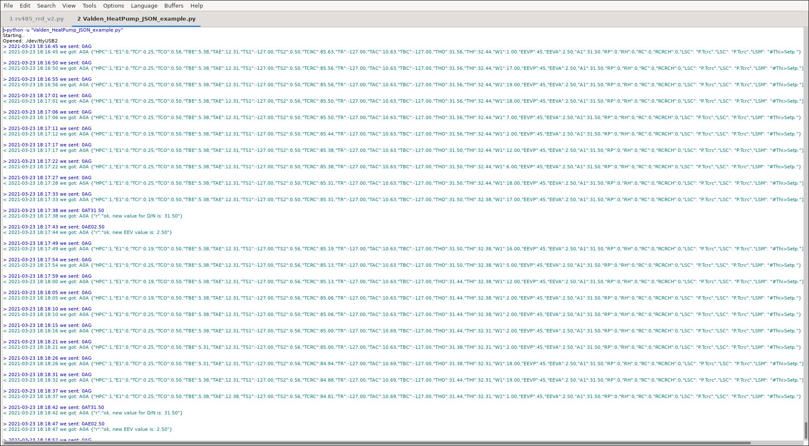
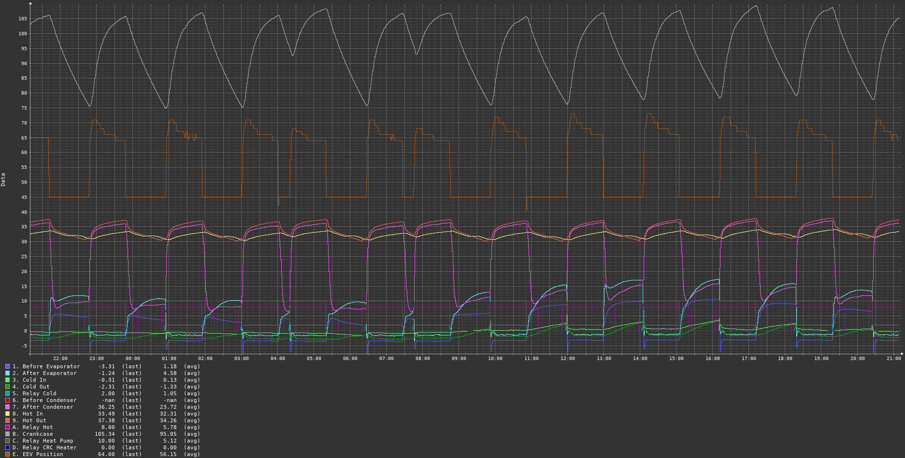

# Valden Heat Pump integration example

This example shows how to access Valden Heat Pump data from server, Raspberry PI, and so on.<br><br>

All you need is a USB->RS485 converter and python2 installed.<br>
Connect your computer to RS485 line as pictured below, connect another side of wire like described at [Valden Display page](https://github.com/openhp/Display/) and run python script from an example below.<br>
Remember: RS485 is a 3-wire line. Do not use cheap converters without "signal ground" and with only A and B. They'll work only for few meters distances.<br>
{-wiring picture-}<br>

```python
import serial
from time import sleep
import datetime
import string
import sys

#-------------------------------------------------------
#function to send commands and print answers
def SendCommand(ID_to, command):
	#send command
	towrite = str(ID) +  str(ID_to) + command
	print "> " + str(datetime.datetime.now())[0:19] + " we sent: " + towrite
	try:
		serial.write(towrite)
	except:		#do not catch all exceptions in a real code
		print "USB>Serial converter disconnected?", sys.exc_info()
		line = None
		return 0
		
	#read result
	try:
		line = serial.readline()   # read a '\n' terminated line
	except:		#do not catch all exceptions in a real code
		print "USB>Serial converter disconnected?", sys.exc_info()
		line = None
		return 0

	#print answer
	if len(line) > 2:
		print "< " + str(datetime.datetime.now())[0:19] + " we got: "+ line
	else:
		print "No answer from", ID_to, "\t\t", str(datetime.datetime.now())[0:19]

#-------------------------------------------------------
#open serial
print "Starting.."
try:
	serial = serial.Serial('/dev/ttyUSB2', 9600, timeout=3)		#Change serial name to yours!
	print "Opened: ", serial.name
except serial.serialutil.SerialException:
	print "Serial open error! Change serial name to yours! (ex: /dev/ttyUSB5, or something like COM9 at win)"
	exit (0)

#-------------------------------------------------------
#some example values
eev_target = "02.50"		#new eev temperature difference
newtemp = "31.50"		#new setpoint temperature

ID 	= chr(0x30)		#this script ID, 0x30 by default, default value supported by all Valden components so do not change it
remote_ID = chr(0x41)		#Remote Display ID ( this display https://github.com/openhp/Display/ or that display https://github.com/openhp/ServiceDisplay/ )
				#Remote Display ID can be changed, and yes: few devices with uniq IDs can work together at the same time at same line

#-------------------------------------------------------
#example cycle, interaction with Remote Display
#commands: 
#(G)et all 
#new (T)emperature set (setpoint) 
#new (E)EV difference set


#cycle sends 10 times (G)er all command
#then sends (T)emperature set 
#then sends (E)EV difference set
#then cycle


while ( 1 == 1):
	for i in xrange (10):
		SendCommand(remote_ID,"G")	#sends 0AG : from ID 0 to ID A (G)et all
		sleep (5)
	SendCommand(remote_ID,"T" + newtemp)	#sends 0AT31.50, command format TNN.NN
	sleep (5)
	SendCommand(remote_ID,"E" + eev_target)	#sends 0AE02.50, command format ENN.NN
	sleep (5)
```
 
Script output example (click to enlarge):<br>
<br>
Short names (keys) specific for JSON communication:
| Abbr. | Full name             |
| ----- | --------------------  |
| A1   | setpoint      		| 
| E1   | error code     	|
| HPC   | Heat Pump connected (to remote display, 1=yes, 0=no)      |
| W1   | Watts    		|

All another abbrevations (keys) you'll see in responses are listed at [HeatPumpController](https://github.com/openhp/HeatPumpController/) appendix.<br><br>


What's next? You have all information you need to integrate, for example, with Home Assistant or another "Smart Home" system you like. Just parse gotten strings (that's very easy in python) and feed key-value pairs to your favourite system.<br>
I do not use "smart home" systems, but I like graphs. Graphs helps to analyse processes dynamics. So I have a script (much more complicated script) on server side, that get stats from all my devices and draw graphs for me.<br>
Example, daily graph for one of my Heat Pumps:<br>
<br><br>
To get graphs you can use something like Cacti monitoring system.<br>
And one more: you can use "set temperature" commands to automatically change "setpoint" temperature and create comfortable balance between power saving and house temperature. Or daily-dependent, hourly-dependent or something-else temperature dependent system.<br><br>


## License
GPLv3. <br>
This product is distributed in the hope that it will be useful,	but WITHOUT ANY WARRANTY; without even the implied warranty of MERCHANTABILITY or FITNESS FOR A PARTICULAR PURPOSE.  See the GNU General Public License for more details.<br>
## Author
<br>
gonzho АТ web.de (c) 2015-2021<br>
